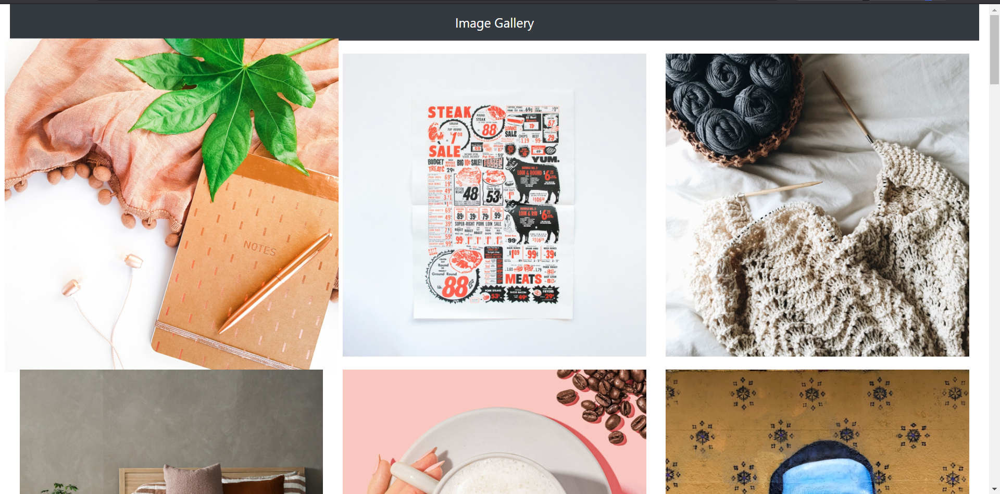

<p align="center">
  

  

</p>

<h2 id="layout"> 🎨 Layout </h2>

<p align="center" style="display: flex; align-items: flex-start; justify-content: center;">
  
</p>

<h2 id="como-executar-o-projeto"> 🚀 Como executar o projeto </h2>

### Pré Requisitos
Antes de começar, você vai precisar ter instalado em sua máquina as seguintes ferramentas:
[Git](https://git-scm.com), [Node.js](https://nodejs.org/en/).

Além disto é bom ter um editor para trabalhar com o código como [VSCode](https://code.visualstudio.com/) <br/> <br/>
Após ter feito a configuração de instalação na máquina é necessário fazer o download do repostiório [aqui](https://github.com/joseaugustodardengo/image-gallery/archive/master.zip)
ou realizar o clone do repositório.
```
git clone https://github.com/joseaugustodardengo/image-gallery
```
Após feito o download, só seguir os passos a seguir no terminal do seu sistema operacional, para conseguir executar os serviços da aplicação.

Você também vai precisa acessar o site: https://unsplash.com/documentation e seguir os passos que está na seção "**Getting started**". Após concluir, você pode acessar seu perfil e pegar sua "**Access Key**" e substituir no arquivo
**.env**.

<h2 id="como-executar-o-projeto"> 🧭 Rodando a aplicação </h2>
Você pode acessar a aplicação pelo <a href="https://image-gallery-react-bootstrap.netlify.app/" target="_blank">link</a> ou seguir os passos abaixo e executar no seu próprio ambiente de desenvolvimento.

```bash

# Acesse a pasta do projeto no seu terminal/cmd
$ cd image-gallery

# Instale as dependências com npm ou yarn
$ npm install
$ yarn

# Em outro terminal, mas no mesmo diretório, execute a aplicação com npm ou yarn
$ npm run dev
$ yarn dev

# A aplicação será aberta na porta:8080 - acesse http://localhost:8080
```
---

<h2 id="tecnologias"> 🛠 Tecnologias </h2>

As seguintes ferramentas foram usadas na construção do projeto:

#### **Website**  ([React](https://reactjs.org/)  +  [TypeScript](https://www.typescriptlang.org/))

-   **[Bootstrap](https://getbootstrap.com/)**
-   **[Axios](https://github.com/axios/axios)**

<h2 id="autor"> Autor </h2>


Feito por **José Augusto Franco Dardengo** <br/>
👋🏽 Entre em contato!

[](https://www.linkedin.com/in/jose-augusto-franco-dardengo/)
[](mailto:jfrancodardengo@gmail.com)
